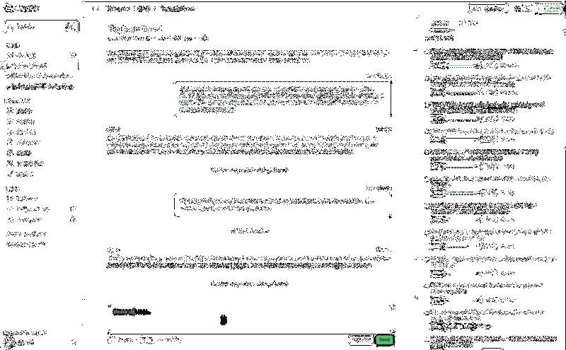

# Metis

Metis is an open-source AI orchestration layer that lets developers coordinate dozens of agents working simultaneously across tasks, issues, and environments.
You assign work through an issue tracker, and Metis automatically spins up agents to implement.
You survey their progress, review their work, and offer course corrections as needed.



## Getting Started

Metis ships a single-player mode that bundles the CLI, server, and web dashboard into one binary (`metis-single-player`). This is the easiest way to get started.

### 1. Clone and build

```bash
git clone https://github.com/dourolabs/metis.git
cd metis
cargo build -p metis-single-player
```

Add the binary to your path:

```bash
cp target/debug/metis ~/.local/bin/metis
# or
export PATH="$PATH:$(realpath ./target/debug/)"
```

### 2. Initialize the server

```bash
metis server init
```

This walks you through an interactive setup: choosing a username, job engine (Docker or local), AI model (Claude or Codex), API keys, and a GitHub PAT. When it finishes, the server is running and the CLI is configured to talk to it.

**Note** Metis runs with agents with `--dangerously-skip-permissions`, so I strongly recommend choosing the Docker engine. No warranties or rebates are provided if you choose Local and Claude `rm -rf`s your machine. The Docker engine is a little more painful to set up, but it's worth it for the isolation.

When Docker is selected as the job engine, the init command automatically builds the `metis-worker:latest` image. This image is used to run agent sessions and includes Node.js, the GitHub CLI, ripgrep, Claude Code, Codex, Playwright, and the Metis CLI itself.

### Worker Docker image

To rebuild the worker image manually (e.g., after updating dependencies or the Metis CLI):

```bash
docker build -f images/metis-worker.Dockerfile -t metis-worker:latest .
```

To use a custom image, set `default_image` in your server's `config.yaml` under the `job` section, or configure it per-repo.

### 3. Add a git repository

Register a repository so agents can work on it:

```bash
metis repos create your-org/your-repo https://github.com/your-org/your-repo.git
```

### 4. Create your first issue

```bash
metis issues create --assignee swe --repo-name your-org/your-repo "Fix the bug in ..."
```

This assigns the issue to `swe`, a software engineering agent. You can watch progress in the dashboard at http://127.0.0.1:8080, or from the CLI:

```bash
metis issues list
metis issues describe <issue-id>
```

Once the agent finishes, it submits a patch and creates a review issue assigned to you. The patch is also pushed to GitHub as a PR.

### 5. Try a more complex task

Metis also has a `pm` (product manager) agent that can break down larger features into subtasks:

```bash
metis issues create --assignee pm --repo-name your-org/your-repo "Build feature XYZ"
```

### Managing the server

```bash
metis server status        # check if the server is running
metis server logs --follow  # tail server logs
metis server stop           # stop the server
metis server start          # start the server again
```

## Core Concepts

### Issues

All work in Metis is represented by issues. Issues are the fundamental unit of work, assigned to either agents or users. Agents have full access to the issue tracker, so they can create subtasks, request reviews, and coordinate with other agents autonomously.

Issues have four statuses: `Open`, `InProgress`, `Closed`, and `Dropped`. They form a graph with two types of relationships: `blocked-on` (issue X cannot start until Y is closed) and `child-of` (issue X is a subtask of Y). The system uses this graph to determine which issues are ready to work on, and automatically spawns agents for ready issues.

When an agent starts working on an issue, it sets the status to `InProgress`. When done, it sets it to `Closed`. If the agent's session ends while the issue is still `InProgress` (e.g., waiting for a code review), another agent can pick it up later with the full git state preserved.

### Document Store

The document store is a shared space for markdown artifacts -- design docs, runbooks, playbooks, and other reference material. Agents and users can read and write documents using the CLI:

```bash
metis documents list
metis documents get <path>
metis documents put <path> --file <file>
```

### Agents

Metis comes with three default agents, created automatically during `metis server init`:

- **`swe`** -- Software engineering agent. Implements code changes, submits patches, and responds to review feedback.
- **`pm`** -- Product manager agent. Breaks down complex features into smaller subtasks and assigns them.
- **`reviewer`** -- Code review agent. Reviews patches and provides feedback.

Agents are configured on the server and can be customized via the API. Each agent has a system prompt, a concurrency limit, and a max-retries setting.

### Git Repositories and Branch Management

Repositories are registered with Metis so agents know where to work. Each issue and task gets tracking branches pushed to the remote:

- `metis/<issue-id>/base` -- where work on the issue started
- `metis/<issue-id>/head` -- the current head of work for the issue

This allows sequential agents working on the same issue to pick up where the previous one left off. You can check out any of these branches to inspect the state of work at any point.

## Code Overview

| Crate | Description |
| --- | --- |
| `metis` | CLI with subcommands for issues, patches, repos, documents, and more. |
| `metis-server` | Axum HTTP API, background workers, and job engine (Docker or local). Handles persistence, scheduling, and GitHub integration. |
| `metis-common` | Shared models and types used across all crates. |
| `metis-bff` | Backend-for-frontend layer: auth routes, API proxy, and embedded frontend serving. |
| `metis-single-player` | All-in-one binary bundling CLI + server + BFF for local single-player use. |
| `metis-web` | React 19 frontend with a dark terminal-inspired UI. A pnpm monorepo containing a typed API client (`@metis/api`), component library (`@metis/ui`), and the SPA + Hono BFF server (`@metis/web`). |
